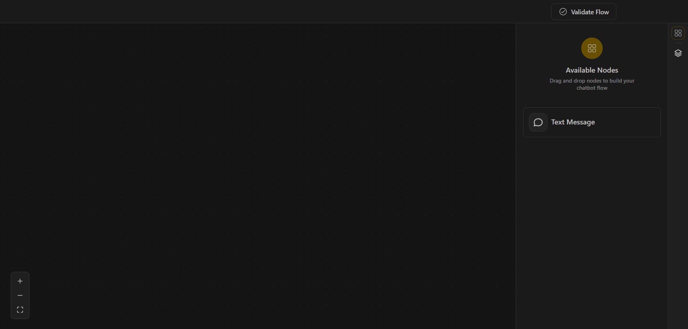
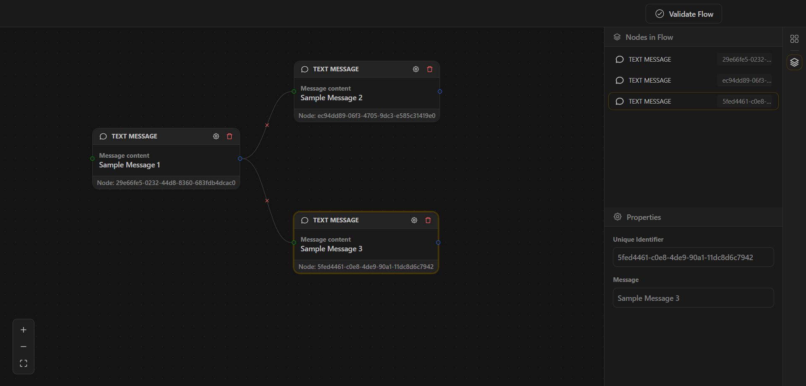

# Chatbot Flow Builder

A drag-and-drop visual tool to design chatbot conversation flows using React and React Flow.

## 🚀 Live Demo

[🔗 View Demo](https://your-live-demo-link.com)

## 🖼️ Screenshots




## ⚙️ Setup

### 1️⃣ Clone the Repo
```bash
git clone https://github.com/munzirc/chatbot-flow-builder.git
cd chatbot-flow-builder
```

### 2️⃣ Install Dependencies
```bash
npm install
# or yarn install
```

### 3️⃣ Run Locally
```bash
npm run dev
```
Visit `http://localhost:5173` (Vite default).

### 4️⃣ Build for Production
```bash
npm run build
```
